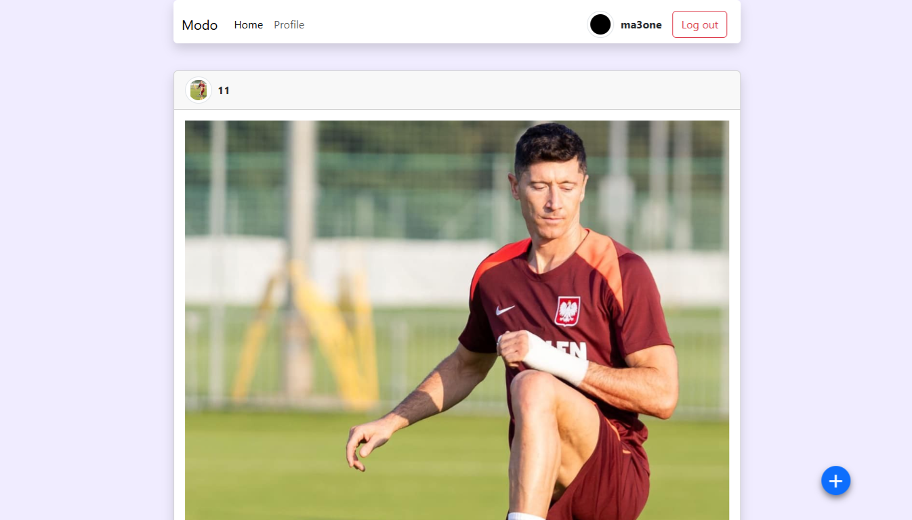

# Social Media Platform

<p>This project is about a social media platform that allows users to create and share posts and is built with HTML, JavaScript, and Bootstrap.</p>


## Features

- User authentication (signup/login/logout)
- Create, edit, and delete posts
- Comment on posts
- User profiles with No bio and posts

## Technologies Used

- Frontend: HTML, CSS, JavaScript, Bootstrap
- Backend: Node.js, API From Yarob
- Authentication: JWT (JSON Web Tokens)

## Installation

1. Clone the repository:

   ```bash
   git clone https://github.com/moaaadl/API.git
   ```

2. Install dependencies:

   ```bash
   npm install
   ```
